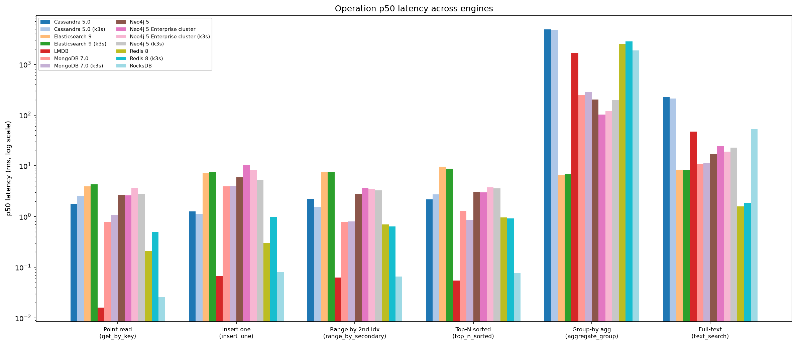
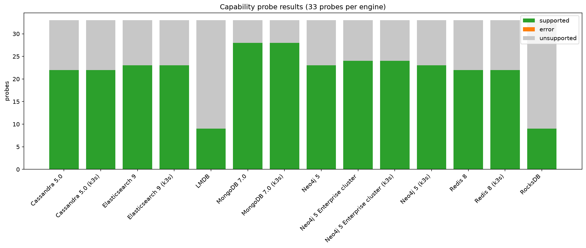

# ns-databases — NoSQL database lab

**[View Interactive Report](https://karatayberkay.github.io/boiler-test-ns-databases/ns-databases-report.html)**

A reproducible lab that stands up **NoSQL engines in Docker Compose** (key-value, document, wide-column, graph, search,
vector and embedded stores — single nodes, replica sets, Sentinels, leaderless clusters), loads the *same deterministic
dataset* into each (the very values used by the sibling relational lab `rd-databases`), and measures six things per engine:

1. **Capabilities** — 33 feature probes (secondary/compound/unique/TTL/text/geo/vector indexes, partial update, atomic
   increment, optimistic concurrency, multi-document transactions, tunable consistency, nested/array queries, aggregation,
   server-side join, graph traversal, schema validation, change streams, scripting, pub/sub, explain, bulk import, large
   docs, replica reads, snapshots, incremental backup, PITR, slow-query log, audit log, structured logs, run-time log
   level). Each probe is run against the engine; `supported` / `unsupported` / `error` is recorded.
2. **Operations** — a portable **operation catalog** of 28 data-access operations (point/batch reads, writes, partial
   updates, atomic increment, compare-and-set, secondary/range/nested/array queries, top-N, offset vs keyset pagination,
   group-by and time-bucket aggregation, join, graph traversal, full-text, geo radius, vector kNN, multi-document
   transaction, TTL, full scan), timed p50/p95 with result checksums. An operation an engine cannot express is `n/a`.
3. **Optimisation** — 9 before/after experiments: secondary index vs full scan, projection, offset vs keyset pagination,
   write batching, batched reads, embedding vs referencing, write durability, read consistency, connection reuse.
4. **Connections & replication** — connect latency, connection storms to the server limit, throughput vs worker processes,
   pool saturation, compare-and-set contention, proxy read/write split; then topology, visibility lag, replica write
   rejection, catch-up under load, read scaling, and (optionally) failover downtime by killing the primary. Plus a
   multi-connection bulk-insert load test with exact per-container CPU/memory (cgroup v2).
5. **Backup & restore** — one full backup with the engine's own tooling (BGSAVE, mongodump --oplog, nodetool snapshot,
   neo4j-admin dump, ES snapshot repository + SLM, LMDB copy, RocksDB checkpoint) while point reads keep running, then
   the data is mutated and the backup restored: backup/restore seconds, artifact vs data size, read latency during the
   backup, downtime for offline steps, an incremental second backup, and a **verified** restore (fingerprint before ==
   after, post-backup writes gone). A separate DR drill (`nslab dr`) exports the artifact, destroys the stack with
   `down -v`, and restores into a fresh one — verified on all seven engines.
6. **Logging** — container log driver + rotation, the engine's own log format/location, a slow-query log round trip
   (a point read that must not be logged, a known-slow operation that must, read back through the engine's interface),
   an audit-log round trip, a run-time log-level change, and the log volume each engine produces. The harness itself
   writes a rotated JSONL run log (`results/logs/nslab.jsonl`).

Everything is driven by one Python harness (`harness/`, `uv run nslab ...`) and summarised in `results/SUMMARY.md`
(+ `docs/report.html`, a self-contained interactive report).

## Report sections
The interactive report (`docs/report.html`) is broken down into per-section markdown explanations, each with the full
data as tables across all engines (including the k3s variants):

- [Engines](docs/explanation-engines.md) — fleet overview: versions, load throughput, replication topologies, per-collection load detail
- [Operation latency & capability matrix](docs/explanation-operations.md) — all 28 catalog operations × every engine (p50/p95/rows, n/a and ERR)
- [Feature probes](docs/explanation-capabilities.md) — 33 capability probes (indexes, consistency, model, operations, limits, logging) × every engine
- [Optimisation experiments](docs/explanation-optimisation.md) — 9 before/after experiments (index, projection, pagination, batching, multi-get, embedding, durability, consistency, connection reuse)
- [Connections & concurrency](docs/explanation-connections.md) — connect latency, throughput vs workers, CAS contention, full concurrency curves
- [Replication & failover](docs/explanation-replication.md) — visibility lag, write rejection, catch-up, read scaling, failover downtime
- [Multi-connection bulk-insert load test](docs/explanation-load-test.md) — docs/s by workers and entry point, busiest container
- [Backup & restore](docs/explanation-backup.md) — backup/restore seconds, artifacts, downtime, verification, incremental, DR drill, strategy notes
- [Logging](docs/explanation-logging.md) — container/server logs, slow-query and audit round trips, run-time level, strategy notes
- [Scenarios](docs/explanation-scenarios.md) — domain workloads (Chatter, GraphRec) with per-op latency tables and curves

## Results at a glance




## Layout
```
stacks/<engine>/compose.yaml + lab.yaml   one directory per engine: compose file, init/config, harness metadata
harness/nslab/                            the harness (schema, datagen, ops, probes, engine adapters, phases, report, cli)
results/<engine>/latest.json              raw results (timings, checksums, errors) + results/SUMMARY.md cross-engine tables
skills/                                   Agent Skills: 10 first-party (written from these results) + vendored third-party
docs/                                     engine matrix, findings, backup-logging, kubernetes, research sources, report.html
k8s/                                      Harbor registry + k3d cluster + compose->kubernetes generator (see docs/kubernetes.md)
scripts/pull-images.sh                    pulls images through mirror.gcr.io (avoids Docker Hub's rate limit)
data/scale-<n>/                           generated NDJSON dataset (seeded; identical to rd-databases' values + geo/vector/embedded fields)
```

## Engines (stack key -> what runs)
| key | engine | family | topology |
|---|---|---|---|
| redis | Redis 8 (RediSearch/JSON/vector built in) | key-value | primary + replica + 3 Sentinels + HAProxy read LB |
| mongodb | MongoDB 7.0 | document | 3-member replica set (auto-election) |
| cassandra | Cassandra 5.0 | wide-column | 3 nodes RF=3, leaderless, LOCAL_QUORUM |
| neo4j | Neo4j 5 Community (+APOC) | graph | single instance (Community cannot replicate) |
| neo4j-cluster | Neo4j 5 Enterprise (evaluation licence, +APOC) | graph | 3 primaries in a Raft cluster, routing URI for writes, online backup + seedURI restore |
| elasticsearch | Elasticsearch 9 | search | 3-node cluster, every index 1 shard + 2 replicas, master election |
| lmdb | LMDB | embedded | in-process (memory-mapped B+tree) |
| rocksdb | RocksDB | embedded | in-process (LSM tree) |

More engines have adapters registered (Valkey/Dragonfly/KeyDB, ScyllaDB, YugabyteDB-YCQL, FerretDB/DocumentDB, Memgraph,
OpenSearch reuse the existing adapters; couchbase/aerospike/qdrant/weaviate/milvus/chroma/surreal/arango/etcd/memcached/
tarantool/ravendb/falkordb/influx are wired in the registry) — see `docs/engine-matrix.md`.

## Quick start
Full walkthrough (setup, per-phase explanation, running everything, reading results, adding engines, troubleshooting):
**[STEP-BY-STEP.md](STEP-BY-STEP.md)**.

```bash
cd harness && uv sync                        # Python 3.12; core drivers (add --all-extras for couchbase/qdrant/... )
uv run nslab gen --scale 1                   # deterministic dataset (~260 MB NDJSON; identical values to rd-databases)
../scripts/pull-images.sh                    # pull every image referenced by stacks/*/compose.yaml via mirror.gcr.io
uv run nslab run redis --failover            # up -> load, capabilities, bench, optimize, connections, loadtest, backup, logging, replication(+failover) -> down
uv run nslab run mongodb --phases load,bench --keep
uv run nslab phase cassandra optimize        # one phase against an already-running stack
uv run nslab phase mongodb backup            # backup -> mutate -> restore -> verify (timed) on a running, loaded stack
uv run nslab backup redis                    # ad-hoc backup with the engine's tooling, exported to data/backups/ (--restore --tag <t> --import to bring it back)
uv run nslab dr redis                        # disaster-recovery drill: backup -> export -> down -v -> fresh up -> import -> restore -> verify
uv run nslab slowlog cassandra --exercise    # provoke one slow query and read the engine's slow log back
uv run nslab report                          # rebuild results/SUMMARY.md
uv run python ../scripts/build-report.py     # rebuild docs/report.html
```
Stack keys: `redis mongodb cassandra neo4j neo4j-cluster elasticsearch lmdb rocksdb` (LMDB and RocksDB are embedded: `up`/`down` are no-ops).

## Scenarios (domain workloads beyond the generic catalog)
Beside the per-operation catalog, the lab has a **scenario** layer: realistic, domain-shaped workloads with a seeded
corpus and a weighted, hotspot-skewed, multi-process load. First scenario — **"Chatter"**, a social messaging store
(register / find-friends + 1:1 & group messaging) built Cassandra-first (operations defined engine-agnostically so
ScyllaDB/MongoDB/Redis can implement the same contract later):
```bash
uv run nslab scenario seed  cassandra --size small                                    # social graph + message backlog
uv run nslab scenario run   cassandra --size small --workers 8,32,64,128 --fanout write   # steady-state ramp
uv run nslab scenario run   cassandra --size small --fanout read                      # fan-in-on-read comparison
uv run nslab scenario curves cassandra --size small                                   # send-vs-group-size, pymk-vs-degree
```
Scenarios so far:
- **Chatter** (Cassandra) — social messaging store: **[docs/scenario-messaging.md](docs/scenario-messaging.md)**
- **GraphRec** (Neo4j) — recommendations + fraud-ring detection: **[docs/scenario-recgraph.md](docs/scenario-recgraph.md)**

List them with `nslab scenario list`; each is `seed` / `run` / `curves` / `drop` selected with `--scenario`.

## Kubernetes (k3s) runtime
The same stacks, phases and scenarios also run on a **k3s cluster** (via k3d, no root) that pulls every image from a
**local Harbor registry** — the same layout as `rd-databases/k8s` (one Harbor per host with a project per lab, one
k3d cluster per lab). Manifests are generated from the compose files (`x-k8s` hints cover what NoSQL needs: Cassandra
seeds/NodePorts instead of static IPs, Neo4j routing addresses, ES memlock), and `NSLAB_PLATFORM=k3s` makes the harness
talk kubectl instead of docker. Results of k3s runs go to `results/k3s/` and show up as `<engine> (k3s)` rows.
```bash
make -C k8s env harbor push gen up          # once: .env, Harbor project + robots, mirror images, manifests, cluster
NSLAB_PLATFORM=k3s uv run --project harness nslab run mongodb --keep --failover     # every phase, on the cluster
NSLAB_PLATFORM=k3s uv run --project harness nslab dr mongodb                        # backup -> delete namespace -> fresh apply -> restore
NSLAB_PLATFORM=k3s uv run --project harness nslab scenario seed cassandra --size small   # domain scenarios, unchanged
k8s/scenarios.sh deploy redis | failover redis | chaos cassandra                     # kubectl-only stories
k8s/run-all-k3s.sh                                                                  # everything, one stack at a time
```
Full guide: **[docs/kubernetes.md](docs/kubernetes.md)**. `k8s/` has its own `make help`.

## Notes
- Numbers are from one 28-core host with all containers on the same machine; cross-node "scaling" is bounded by that,
  and the first pass had light cross-engine contention — run `scripts/run-all.sh` (sequential) for clean numbers.
- **MongoDB 8 does not start on this host's Linux 7.0 kernel** (SERVER-121912); the lab pins `mongo:7`. See `docs/engine-matrix.md`.
- `--failover` kills the primary container; the stack must be recreated afterwards (`nslab run` does `down -v`).
- The backup phase restarts the primary for engines whose restore is offline (Redis, Neo4j Community); it runs before
  `replication` so a `--failover` run still targets the real primary. `docs/backup-logging.md` has the per-engine
  strategy tables and the traps (AOF ignores dump.rdb, Sentinel during a restore, sstableloader vs `vector<>` types,
  `destructive_requires_name`, Neo4j Community's empty query.log ...).
- See `skills/` for the distilled how-to knowledge and `docs/findings.md` for the surprising results.
